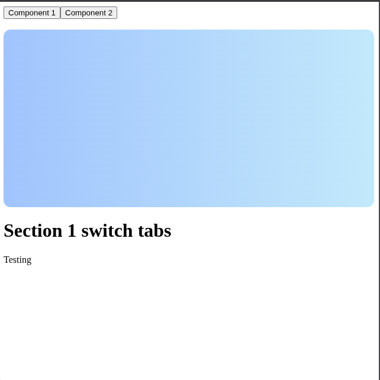

This is a small React component where I'm learning how to dynamically change the background of a section based on which button is clicked. I'm practicing React concepts like **props**, **state**, **conditional rendering**, and **inline styles**.

##  What It Does

- There are two buttons: **Component 1** and **Component 2**
- Clicking a button triggers a function that updates which "page" or "section" is active
- The background of the content area updates based on the selected section using simple inline styling

##  Why I Built This

I'm currently learning React by **building small projects and components** that help me understand how props, state, and styling work together. 

